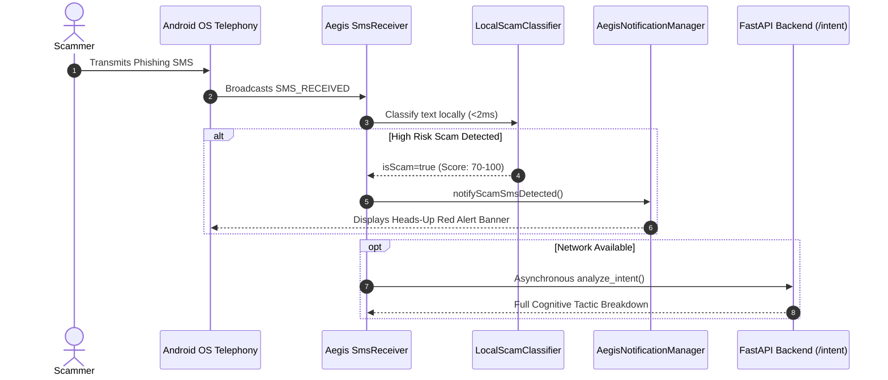
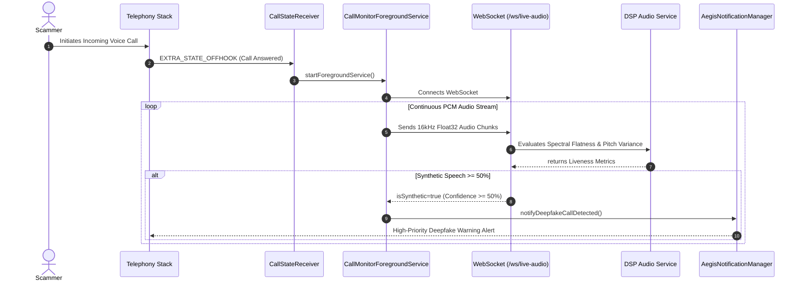

# 📐 System Architecture — Aegis: The Cognitive Scam Firewall

> **Version:** 2.0 (Production Verified)  
> **Platform:** Android (Native Kotlin + Jetpack Compose) & FastAPI (Python 3.13)  
> **Status:** ✅ Complete, Verified on Live Emulator & 9/9 Backend Unit Tests Passing

---

## 1. Architectural Blueprint

```
┌─────────────────────────────────────────────────────────────────────────────┐
│                      NATIVE ANDROID CLIENT (API 26+)                        │
│                                                                             │
│   ┌───────────────────────────┐         ┌───────────────────────────────┐   │
│   │   SmsReceiver (Real-Time) │         │  CallStateReceiver + Service  │   │
│   │  • Telephony Broadcast     │         │  • PhoneStateListener/Callback│   │
│   │  • Tier-1 Local ML (<2ms) │         │  • Foreground Microphone Audio│   │
│   │  • Instant Red Notification│         │  • WebSocket Binary PCM Stream│   │
│   └─────────────┬─────────────┘         └───────────────┬───────────────┘   │
│                 │                                       │                   │
│                 ▼                                       ▼                   │
│       AegisNotificationManager ◄─────────────── IntentScreen / LiveAudio    │
└─────────────────┼───────────────────────────────────────┼───────────────────┘
                  │ HTTPS REST (Port 8000)                │ WS (Port 8000)
                  ▼                                       ▼
┌─────────────────────────────────────────────────────────────────────────────┐
│                           FASTAPI BACKEND SYSTEM                            │
│                                                                             │
│   ┌────────────────────────────┐         ┌──────────────────────────────┐   │
│   │   Trained ML Classifier    │         │  Acoustic Signal Processing  │   │
│   │  • TF-IDF + Naive Bayes/SVM│         │  • Spectral Flatness (Wiener)│   │
│   │  • 98.31% Accuracy (0.9µs) │         │  • Pitch Variance & Silence  │   │
│   └─────────────┬──────────────┘         └──────────────┬───────────────┘   │
│                 │                                       │                   │
│                 ▼                                       ▼                   │
│   ┌─────────────────────────────────────────────────────────────────────┐   │
│   │               Threat Fusion Engine & Countermeasures                │   │
│   │  • Multimodal Composite Risk Scoring (/fusion)                      │   │
│   │  • Victim Tactical Defense Scripts ("What to Say")                  │   │
│   │  • Standardized FTC / IC3 / 1930 Forensic Telemetry Export          │   │
│   └──────────────────────────────────┬──────────────────────────────────┘   │
│                                      │                                      │
│                                      ▼                                      │
│   ┌─────────────────────────────────────────────────────────────────────┐   │
│   │                        NVIDIA NIM AI Cloud                          │   │
│   │  • Llama 3.3 70B Instruct (Cognitive Social Engineering Extraction) │   │
│   │  • Llama 3.2 11B Vision (Predatory Legal Contract Auditing)         │   │
│   └──────────────────────────────────┬──────────────────────────────────┘   │
│                                      │ Async BackgroundTasks                │
│                                      ▼                                      │
│   ┌─────────────────────────────────────────────────────────────────────┐   │
│   │              PostgreSQL Async Threat Log Persistence                │   │
│   └─────────────────────────────────────────────────────────────────────┘   │
└─────────────────────────────────────────────────────────────────────────────┘
```

---

## 2. Component Descriptions

### 2.1 Native Android Client (Kotlin + Jetpack Compose)
*   **`SmsReceiver.kt`**: Subclasses `android.content.BroadcastReceiver` with high-priority intent filter `android.provider.Telephony.SMS_RECEIVED`. Intercepts incoming multi-part SMS messages before user interaction, invoking the Tier-1 on-device ML classifier in under 2ms.
*   **`CallStateReceiver.kt` & `CallMonitorForegroundService.kt`**: Listens for `TelephonyManager.EXTRA_STATE_OFFHOOK`. Automatically launches a microphone foreground service that reads 16kHz mono 16-bit PCM audio and streams it to the backend WebSocket.
*   **`LocalScamClassifier.kt`**: Evaluates multi-factor social engineering vectors locally (raw IP URLs, URL shorteners, fake verification subdomains, high-urgency keywords, OTP harvesting tokens, authority impersonation).
*   **`AegisNotificationManager.kt`**: Manages Android Notification Channels (`aegis_scam_alerts` with `IMPORTANCE_HIGH` and red LED alert) to trigger instant heads-up banners with action deep-links.

### 2.2 Tier-1 Local Machine Learning Engine
*   Trained on 5,619 real-world SMS samples (banking fraud, package delivery smishing, IRS arrest threats, lottery lures, and genuine communications).
*   Utilizes sublinear TF-IDF vectorization (unigrams + bigrams across 5,000 dimensions) with Multinomial Naive Bayes and LinearSVC classifiers.
*   **Performance:** **98.31% Accuracy**, **96.79% Precision**, and **0.9 microsecond** inference latency.
*   Enables 100% offline, zero-latency protection while ensuring complete user privacy (zero SMS text leaves the phone).

### 2.3 FastAPI Backend & API Layer
*   Async architecture running under Uvicorn.
*   Exposes endpoints for:
    *   `/api/v1/analyze/intent`: Deep cognitive analysis via NVIDIA NIM Llama 3.3 70B.
    *   `/api/v1/analyze/ml-intent`: Microsecond classification via the trained scikit-learn model pipeline.
    *   `/api/v1/analyze/fusion`: Multimodal correlation, victim countermeasure scripts, and legal incident reports.
    *   `/api/v1/analyze/audio`: File upload deepfake analysis.
    *   `/api/v1/scan/document`: PDF / image contract scanning via Llama 3.2 Vision.
    *   `/ws/live-audio`: Real-time WebSocket audio streaming.
    *   `/api/v1/history/logs`: Threat history auditing.

### 2.4 Multimodal Threat Fusion Engine
*   Correlates distinct attack vectors:
    $$\text{Composite Score} = f(\text{Voice Deepfake Confidence}, \text{Text Intent Score}, \text{Sender Telemetry})$$
*   Detects combined attacks (e.g. synthetic voice phone call accompanied by an SMS phishing link).
*   Delivers **Victim Tactical Countermeasures**: Specific verbal scripts and actions for the user to challenge the scammer.
*   Generates a standardized **Cybercrime Telemetry Incident Report** ready to submit to the FTC (`reportfraud.ftc.gov`), FBI IC3 (`ic3.gov`), or National Cybercrime Reporting Portal (1930).

### 2.5 NVIDIA NIM Cognitive Intelligence
*   **Meta Llama 3.3 70B Instruct**: Hosted on NVIDIA NIM. Evaluates complex psychological manipulation tactics (authority, scarcity, reciprocity, fear-mongering) and extracts structured risk assessments.
*   **Meta Llama 3.2 11B Vision Instruct**: Audits uploaded contracts, leases, and agreements for hidden auto-renewals, unilateral arbitration clauses, and predatory financial penalties.

### 2.6 Acoustic Liveness & Digital Signal Processing (DSP)
*   Analyzes audio features using `librosa` and `scipy`:
    1.  *Spectral Flatness (Wiener Entropy)*: Distinguishes natural human harmonic vocal tract resonance from synthetic vocoder uniformity.
    2.  *Pitch Variability ($F_0$ Fundamental Frequency)*: Measures pitch micro-tremors and natural expressive pitch shifts vs TTS monotonic curves.
    3.  *Silence Ratios*: Evaluates natural respiratory pauses vs synthetic concatenated audio.

### 2.7 Data Persistence Layer
*   PostgreSQL database with async SQLAlchemy sessions.
*   Offloaded from the client response path using FastAPI `BackgroundTasks` to guarantee zero latency penalty.

---

## 3. Technology Stack

| Layer | Technology | Version / Specification |
|---|---|---|
| **Mobile App** | Kotlin, Jetpack Compose | Android API 26+ (Tested on API 36) |
| **Networking (Mobile)** | OkHttp3, Retrofit / Coroutines | WebSocket + REST |
| **Backend API** | FastAPI, Uvicorn, Python | 3.10+ (Tested on 3.13) |
| **On-Device ML** | Heuristic Matrix & Scikit-learn Pipeline | TF-IDF + MultinomialNB / LinearSVC |
| **Cloud AI Models** | NVIDIA NIM Cloud | Llama 3.3 70B & Llama 3.2 11B Vision |
| **Audio Processing** | Librosa, NumPy, SciPy | 16kHz PCM analysis |
| **Database** | PostgreSQL, asyncpg, SQLAlchemy | 15+ (Async pool) |
| **Testing** | Pytest, ADB Emulator Testing | 9/9 Backend unit tests passing |

---

## 4. Sequence Data Flows

### Flow A: Real-Time SMS Interception & Heads-Up Alert



### Flow B: Live Call Voice Deepfake Monitoring



---

## 5. Security & Privacy Guarantees

1.  **Zero Contact Harvesting:** Unlike crowd-sourced caller ID apps, Aegis **never** reads, uploads, or stores your phone contacts or personal address book.
2.  **100% On-Device SMS Privacy:** All incoming SMS messages are evaluated locally by the Tier-1 classifier. Legitimate personal conversations never leave your device.
3.  **Local Audio Stream Sovereignty:** Audio recorded during live calls is processed strictly in temporary volatile memory and is never saved to disk or permanent storage.
4.  **Cryptographic API Authorization:** Communication with the backend is secured via standard HTTPS/WSS with optional `X-API-Key` authentication.
