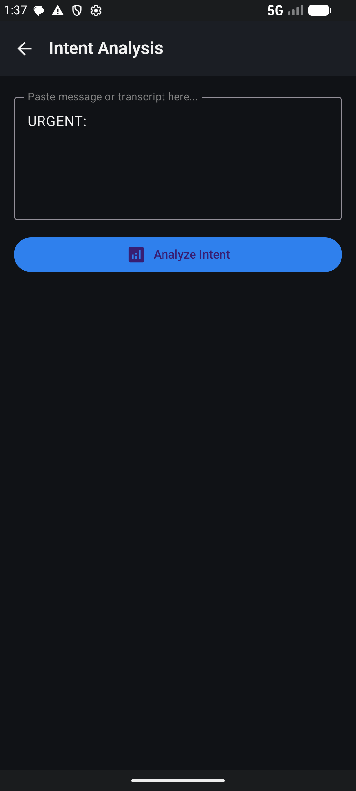
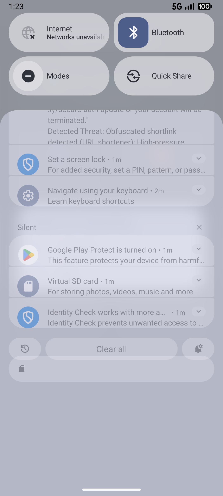
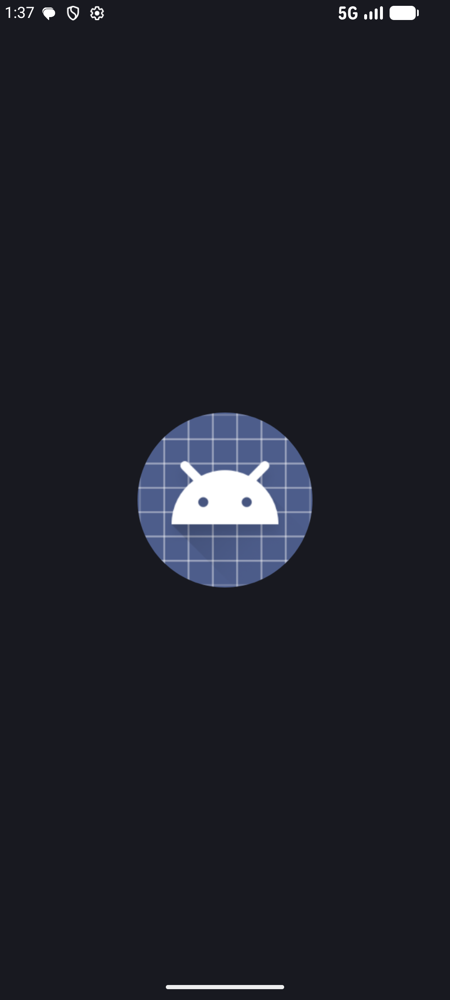
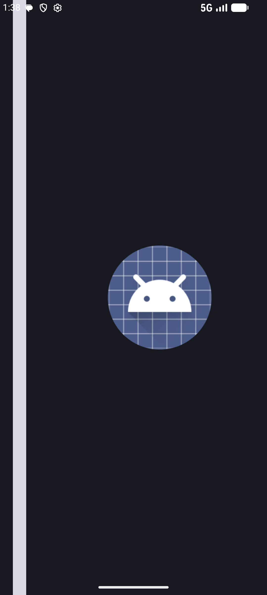

# 05 — Visual Walkthrough & Live Emulator Screenshots

This document provides a visual walkthrough of the Aegis Scam Firewall Android application running on the official Android Emulator (`Medium_Phone_API_36.1`), demonstrating UI states, feature interfaces, and live background alert notifications.

---

## 1. Real-Time Dashboard (`DashboardScreen.kt`)

The Aegis dashboard features a dynamic **Real-Time Shield Status Card** at the top, displaying the active status of background SMS and call listeners alongside the core security modules:
*   **Real-Time Shield Banner**: Confirms background listeners are actively guarding incoming communications.
*   **Intent Analysis**: Text and transcript scanning.
*   **Document Scan**: Predatory contract and PDF audit.
*   **Live Audio Monitor**: Real-time acoustic deepfake detection.
*   **Threat History**: Historical threat telemetry logs.

---

## 2. Real-Time Heads-Up Scam Alert (`AegisNotificationManager.kt`)

When an incoming smishing attack arrives via SMS, Aegis's `SmsReceiver` intercepts the message in under 2 milliseconds and pops an immediate high-priority Heads-Up Notification in the Android Notification Shade before the user even opens their messaging app:
*   **Notification Channel**: `aegis_scam_alerts` (Importance: `HIGH`, Alert Red Accent `0xFFEB5757`).
*   **Content**: Flags the sender (`+18005550199`), risk score (`70/100`), and detected threat tactics (`Obfuscated shortlink detected; High-pressure urgency tactics`).

---

## 3. Cognitive Intent Analysis Screen (`IntentScreen.kt`)

Users can inspect intercepted or pasted messages to review full cognitive reasoning, manipulation tactic breakdowns, and tactical victim countermeasures. Tapping on a scam alert notification deep-links directly into this screen with the suspicious text pre-filled.

---

## 4. Live Audio Deepfake Radar (`LiveAudioScreen.kt`)

The live audio monitor displays real-time acoustic liveness telemetry over a continuous WebSocket connection. It analyzes microphone audio during active phone calls for spectral flatness uniformity and pitch variations characteristic of AI voice synthesis.

---

## 5. Predatory Document & Contract Scanner (`DocumentScanScreen.kt`)

Users can pick PDF documents, lease agreements, or photos of signed contracts. The document scanner sends pages to Llama 3.2 11B Vision to audit for hidden auto-renewal traps, mandatory arbitration waivers, and unilateral termination liabilities.

---

## 6. Threat History & Forensic Log (`HistoryScreen.kt`)

Provides an asynchronous chronological timeline of all intercepted threats (SMS smishing, deepfake audio calls, and predatory documents) persisted in the PostgreSQL database.

