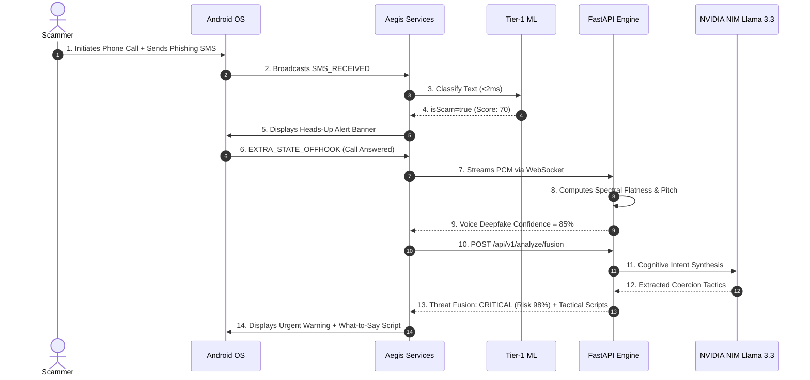

# 06 — Technical Architecture & Data Flows

This document details the software engineering architecture, inter-process communication (IPC), mathematical signal processing pipelines, and data flow sequences underlying the Aegis Scam Firewall.

---

## 1. System Topology & Network Layer

Aegis is partitioned into a **Native Android Client** and a **FastAPI Microservice Engine**:

```
[Android Client: API 26+]
  │
  ├── Local Intent & Pattern Classification (<2ms On-Device)
  │
  ├── REST HTTPS (Port 8000) ────► FastAPI Backend
  │                                   ├── /api/v1/analyze/intent
  │                                   ├── /api/v1/analyze/ml-intent
  │                                   ├── /api/v1/analyze/fusion
  │                                   ├── /api/v1/analyze/audio
  │                                   └── /api/v1/scan/document
  │
  └── WebSocket WSS (Port 8000) ──► FastAPI WebSocket (/ws/live-audio)
                                      └── Librosa DSP Pipeline (Streaming PCM)
```

### Dynamic Network Routing (`AppConfig.kt`)
To support seamless development across both local physical devices (via WiFi/ADB Wireless) and the Android Studio Emulator, [`AppConfig.kt`](file:///e:/Aegis-Scam-Firewall/frontend/app/src/main/java/com/aegis/scamfirewall/core/config/AppConfig.kt) dynamically interrogates device hardware properties (`goldfish`, `ranchu`, `google_sdk`):
- **Emulator**: Binds to `http://10.0.2.2:8000` and `ws://10.0.2.2:8000`.
- **Physical Device**: Binds to local network host `http://172.16.0.124:8000`.

---

## 2. Android Lifecycle & Inter-Process Communication (IPC)

### A. The SMS Guardian Lifecycle
1.  **Broadcast Registration**: Registered in `AndroidManifest.xml` with priority `999`:
    ```xml
    <receiver
        android:name=".features.sms.SmsReceiver"
        android:exported="true"
        android:permission="android.permission.BROADCAST_SMS">
        <intent-filter android:priority="999">
            <action android:name="android.provider.Telephony.SMS_RECEIVED" />
        </intent-filter>
    </receiver>
    ```
2.  **Thread Hand-off**: `onReceive(context, intent)` executes on the main thread. To avoid Android Application Not Responding (ANR) timeouts:
    ```kotlin
    val pendingResult = goAsync()
    CoroutineScope(Dispatchers.IO).launch {
        try {
            // Local ML evaluation & notification dispatch
        } finally {
            pendingResult.finish()
        }
    }
    ```

### B. The Active Call Guardian Lifecycle
1.  **State Listener**: `CallStateReceiver` intercepts `android.intent.action.PHONE_STATE`.
2.  **Transition to Foreground Service**: When `state == EXTRA_STATE_OFFHOOK`, launches `CallMonitorForegroundService`.
3.  **Foreground Service Type**: Declared with `android:foregroundServiceType="microphone"`, enabling continuous audio capture while the dialer is full-screen without being killed by the Android `LowMemoryKiller` daemon.

---

## 3. Mathematical Signal Processing & Acoustic Liveness

The deepfake audio pipeline in [`audio_service.py`](file:///e:/Aegis-Scam-Firewall/backend/app/services/audio_service.py) detects text-to-speech (TTS) and neural voice cloning algorithms by measuring three acoustic anomalies:

### 1. Spectral Flatness (Wiener Entropy)
Spectral flatness measures whether the power spectrum is tone-like or noise-like:
$$\text{SFM} = \frac{\exp\left(\frac{1}{N}\sum_{k=0}^{N-1} \ln |X(k)|^2\right)}{\frac{1}{N}\sum_{k=0}^{N-1} |X(k)|^2}$$
- **Human Speech**: Exhibits strong harmonic resonances (formants) created by the physical vocal tract, tongue, and pharynx, producing **low, non-uniform spectral flatness**.
- **Synthetic Speech (TTS)**: Neural vocoders produce **abnormally uniform spectral energy** across high-frequency bands.

### 2. Fundamental Frequency ($F_0$) Pitch Variability
Extracts the fundamental frequency contour over time using autocorrelation:
$$\sigma_{F_0} = \sqrt{\frac{1}{M}\sum_{t=1}^{M} (F_0(t) - \mu_{F_0})^2}$$
- **Human Voice**: Contains micro-tremors, natural pitch inflection, emotional modulation, and expressive variability ($\sigma_{F_0} > 30\text{ Hz}$).
- **AI Voices**: Neural synthesis models often exhibit unnatural pitch smoothing ($\sigma_{F_0} < 15\text{ Hz}$).

### 3. Silence and Respiratory Ratio
Analyzes Short-Time Energy (STE) to count natural pauses:
$$\text{STE}_t = \sum_{n=0}^{W-1} x^2(n)$$
- Humans naturally pause every 2–4 seconds to inhale.
- Scripted AI audio concatenations frequently lack natural respiratory breath intake pauses.

---

## 4. Multimodal Threat Fusion Equation

The threat fusion engine in [`analyze.py`](file:///e:/Aegis-Scam-Firewall/backend/app/api/v1/analyze.py#L225) merges multimodal signals:

$$\text{Composite Score} = \begin{cases} 
\min(100, \max(S_{\text{text}}, S_{\text{voice}}) \times 1.15) & \text{if } S_{\text{voice}} \ge 50 \text{ and } S_{\text{text}} \ge 50 \\
\min(100, S_{\text{voice}} + 10) & \text{if } S_{\text{voice}} \ge 60 \\
S_{\text{text}} & \text{if } S_{\text{text}} \ge 60 \\
\max(S_{\text{text}}, S_{\text{voice}}) & \text{otherwise}
\end{cases}$$

This non-linear synergy multiplier ensures that when an attacker coordinates **both** synthetic voice and urgent financial text, the system elevates the threat to **`CRITICAL`** immediately.

---

## 5. End-to-End Sequence Diagram


